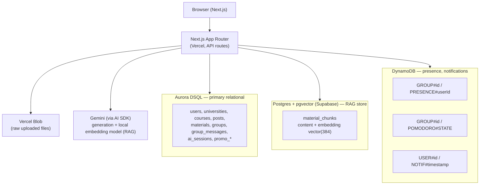

# Architecture

## System overview

## Why three databases, not one

This is a deliberate polyglot-persistence design, not accidental sprawl — each store is doing a job the others are a poor fit for.

**Aurora DSQL — primary relational data.** Users, universities, courses, posts, comments, materials, study groups, group messages, AI chat sessions, promo codes. This is the system of record: relational, transactional, needs to support arbitrary joins (e.g. "all groups a user is a member of, joined through courses, joined through universities" — see `src/app/(main)/study/page.tsx`). Aurora DSQL's distributed active-active model is the part of the judging brief this project is explicitly built to exercise.

**Postgres + pgvector (Supabase) — vector search.** Aurora DSQL does not support the `pgvector` extension, so the RAG store lives in a separate Postgres instance. This is the one place in the system where two different Postgres-family databases genuinely need to coexist rather than being consolidated — material chunk content + 384-dim embeddings, queried by cosine distance (`<=>` operator) per course. Material titles still live in Aurora DSQL, so a chunk search result is enriched with a second lookup (`src/lib/ai/ingest.ts:searchChunks`) rather than denormalizing the title into the vector store.

**DynamoDB — ephemeral, high-write real-time state.** Presence heartbeats and notifications are write-heavy, read-by-single-key, and don't need relational integrity — a poor fit for paying Aurora DSQL's transactional overhead on every 2.5-second presence tick. Single-table design: `meridian-dev-presence` holds both presence rows (`GROUP#<id>` / `PRESENCE#<userId>`) and the one Pomodoro state row per group (`GROUP#<id>` / `POMODORO#STATE`) side by side, so a live study-group panel issues exactly one `Query` to get both. `meridian-dev-notifications` is keyed `USER#<userId>` / `NOTIF#<timestamp>#<random>`, giving "most recent N" for free via `ScanIndexForward: false`.

A fourth table (`DYNAMODB_TABLE_ACTIVITY`) is provisioned in env vars but intentionally unused — an early plan included an activity-feed table, but no feature actually needed it once group chat and notifications existed, so it was cut rather than built speculatively.

## Auth

NextAuth v5, Google OAuth only, JWT session strategy (no database adapter — sessions are self-contained signed tokens, not rows in Aurora DSQL). `src/proxy.ts` is the single auth gate: every route redirects to `/login` unless it's in an explicit public-paths allowlist (`/`, `/login`, `/register`, `/api/auth`, `/api/test`).

`/api/test` is allowlisted specifically for `POST /api/test/login`, an E2E-test-only endpoint that mints a session JWT directly via `next-auth/jwt`'s `encode()`, bypassing the Google OAuth screen (which Playwright cannot reliably drive — consent screens, CAPTCHA risk). It's gated by `NODE_ENV !== "production"` AND a required `E2E_TEST_SECRET` env var that must never be set in a deployed environment; both checks happen inside the route handler itself, independent of the proxy allowlist.

## AI tutor: ingestion + retrieval + generation

**Ingestion** (`src/lib/ai/ingest.ts`, triggered fire-and-forget from `POST /api/materials`): extract text (PDF via `pdfjs-dist`, including a Google Drive virus-scan-page workaround for large files; plain text otherwise) → chunk (`src/lib/ai/chunk.ts`, ~1800 chars with 200-char overlap, breaking on sentence boundaries where possible) → embed each chunk locally (`src/lib/ai/embed.ts`, `Xenova/all-MiniLM-L6-v2` via `@huggingface/transformers`, 384 dims, batched 8-at-a-time to bound memory) → insert into `material_chunks` in the Supabase pgvector store. Idempotent: re-ingesting a material that already has chunks is a no-op. Status (`processing`/`done`/`failed`) is tracked on the `materials` row in Aurora DSQL so the UI can show ingestion state.

The local embedding model was a deliberate choice over a hosted embedding API: no API key, no per-call billing, no rate limit to manage during a demo. The trade-off is cold-start latency on the first call in a fresh serverless instance — acceptable for a hackathon demo, called out in code as a thing to swap before a real production deploy if that latency matters.

**Retrieval + generation** (`src/lib/ai/tutor-prompt.ts`, shared by both the 1-on-1 AI Tutor tab and `@AI` group mentions): embed the user's question with the same local model, `searchChunks()` the top-5 most similar chunks for that course, build a system prompt that explicitly instructs the model to answer only from the retrieved context, then either `streamText` (1-on-1 chat, live UI) or `generateText` (group mentions, fire-and-forget background reply) via the Vercel AI SDK against Gemini.

**Persistence**: 1-on-1 chat history is saved per `(userId, courseId)` in `ai_sessions` (Aurora DSQL) inside `toUIMessageStreamResponse`'s `onFinish` callback — the only point at which the complete message list, including the assistant's finished reply, is available. An earlier version persisted before streaming and always lost the assistant's reply; this is why `onFinish` matters specifically, not just "persist somewhere."

## Real-time: study group presence, chat, Pomodoro

No WebSocket infrastructure — `GET /api/study-groups/[id]/live` is a single `ReadableStream` (`text/event-stream`, native `EventSource` on the client) per connected member. Every ~2.5s it: re-writes the caller's own presence heartbeat, re-queries DynamoDB for the group's presence + Pomodoro state (diffed against the last-sent snapshot, only emitting an event on change), and queries `group_messages` in Aurora DSQL for rows newer than the last-seen cursor. Connection cleanup is wired to `req.signal`'s abort event so a closed tab stops the server-side interval instead of polling for the rest of the function's lifetime.

The Pomodoro timer streams state _transitions_ only (start/pause/reset), not a per-second tick — each client computes its own live countdown locally from `endsAt`. This cuts the poll payload to near-zero during a 25-minute session instead of pushing a tick every few seconds.

Presence "online" is computed from heartbeat recency (`lastSeenAt` within ~20s), not DynamoDB TTL deletion — TTL cleanup isn't instant enough to drive a live "who's online" indicator.

## What's intentionally not built

Documented here instead of left implicit, since a judge re-deriving "is this a bug or a choice" from the code alone shouldn't have to guess:

- **Payment processing**: "Upgrade to Pro" sets `users.isPro = true` directly — no Stripe/payment processor. Promo code redemption is the only "real" monetization mechanic (extends a trial, idempotent per user via `promo_redemptions`).
- **Distributed rate limiting**: `src/lib/rate-limit.ts` is an in-memory sliding-window `Map`, reset per server instance. Upstash Redis credentials are provisioned in env but not wired up — the file documents the upgrade path (`INCR` + `EXPIRE`) inline.
- **Referential integrity at the DB layer**: Aurora DSQL doesn't support foreign keys or robust composite unique constraints in the way standard Postgres does. Every relationship that would normally be an FK is enforced at the application layer (e.g. membership checks before inserts), and every "exactly once" constraint (promo redemption, vote toggle, ingestion idempotency) is a select-then-act check rather than a DB-level unique index.
- **Real course material seeding**: the seed script provisions real universities and courses, but not real past exams/notes — deferred deliberately so the AI tutor demo path is "judge uploads a real document, asks a real question" rather than relying on pre-canned content.
